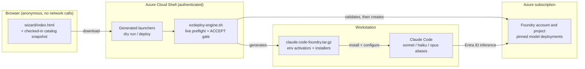

# Claude Code on Microsoft Foundry EZDeploy

Deploy the Azure resources and exact Claude model versions needed to use Claude Code with Microsoft Foundry. The browser wizard generates an Azure Cloud Shell launcher; the Bash engine validates the live catalog and quota, creates or reuses resources, and produces a workstation configuration.

> [!IMPORTANT]
> This is an unofficial community sample. It is not an official Microsoft or Anthropic product and is not supported under either company's product support commitments. Microsoft, Azure, Microsoft Foundry, Anthropic, Claude, and Claude Code are trademarks of their respective owners.

## Quick start

The full flow is five steps; each links to its detailed section below.

1. Open [`wizard/index.html`](wizard/index.html) in a browser and select the Azure target and exact model versions, capacities, and Claude Code defaults. No sign-in or network access is required. See [Anonymous regional model catalog](#anonymous-regional-model-catalog).
2. Download the generated dry-run and deployment launchers. See [Generate the launchers](#generate-the-launchers).
3. Upload both launchers and `scripts/ezdeploy-engine.sh` to one Azure Cloud Shell folder and run the dry run to validate the live catalog, quota, and existing resources without changes. See [Run the dry run first](#run-the-dry-run-first).
4. Run the deployment launcher, review the live preflight output, and type `ACCEPT`. See [Confirm and deploy](#confirm-and-deploy).
5. Download the generated workstation package and run its installer to configure Claude Code. See [Generated workstation package](#generated-workstation-package) and [Verify Claude Code](#verify-claude-code).



## What this repository contains

| Path | Purpose |
|---|---|
| `wizard/index.html` | Select an Azure target, then exact regional model versions, deployment names, capacities, and Claude Code family defaults. |
| `wizard/catalog/catalog.generated.js` | Checked-in regional snapshot generated from the official Azure catalog for anonymous local use. |
| `wizard/catalog/catalog.overlay.js` | Human-curated friendly names, ordering, default deployment names, and EZDeploy Recommended/Tested status. |
| `wizard/catalog/catalog.fallback.js` | Curated emergency catalog used when the generated snapshot is missing or malformed. |
| `scripts/ezdeploy-engine.sh` | Validate and deploy the selected configuration from Azure Cloud Shell. |
| `scripts/generate-model-catalog.js` | Normalize and validate regional Azure catalog responses without third-party packages. |
| `tests/run-regression.ps1` | Run the wizard and engine regression suites locally. |
| `tests/catalog-generator-regression.js` | Test catalog normalization and last-known-good failure behavior. |
| `tests/wizard-regression.js` | Test wizard validation and launcher generation. |
| `tests/engine-regression.sh` | Test engine behavior with fixtures and a fake Azure CLI. |

The wizard-generated launcher and `scripts/ezdeploy-engine.sh` must be uploaded to the same Cloud Shell folder.

## Before you start

You need:

1. A paid Azure subscription. Model deployments and supporting resources can incur charges.
2. Permission to create or update a resource group, an `AIServices` account, a Foundry project, and model deployments.
3. Role-assignment permission only if you choose to assign the signed-in user.
4. A runtime role recognized by the engine for each Claude Code user: Cognitive Services User, Cognitive Services OpenAI User, Cognitive Services OpenAI Contributor, Foundry User, Foundry Owner, Foundry Project Manager, Azure AI Project Manager, Azure AI User, Azure AI Owner, or Azure AI Developer.
5. Authority to provide the responsible legal organization's name, two-letter country code, and industry.
6. Authority to approve the selected billable capacities, applicable Anthropic Azure Marketplace terms, and each model version's hosting and data boundary.
7. Regional model availability and quota for every exact model, version, SKU, and capacity selected.
8. Azure CLI 2.83.0 or later. Azure Cloud Shell also supplies Bash, `jq`, and `tar`.

New Foundry accounts are configured for Microsoft Entra ID authentication only. When an existing account is reused, the engine preserves its current local-authentication setting by default so existing key-authenticated workloads are not broken. The project does not create, retrieve, or store API keys.

Owner, Contributor, Cognitive Services Contributor, Foundry Account Owner, and Azure AI Account Owner are management-plane roles. They do not provide the data-plane access required for Entra-authenticated model inference.

## Security and network considerations

The engine creates or reuses an `AIServices` account with a custom service endpoint. It does not configure private endpoints, network isolation, firewall rules, or an organization-specific data perimeter. Unless you separately restrict the Azure resource, its service endpoint is public and protected by Azure authentication and authorization. Review your organization's networking, Conditional Access, data residency, logging, and model-use requirements before deployment.

Generated configuration files contain identifiers such as subscription ID, tenant ID, resource names, project endpoints, deployment names, and model versions. They are not intended to contain secrets, but they may expose environment metadata. Store and share them accordingly. See [SECURITY.md](SECURITY.md) for additional limitations.

## Anonymous regional model catalog

Open `wizard/index.html` directly from the repository. The wizard does not authenticate to Azure, require a web server, or use GitHub Pages. It loads `wizard/catalog/catalog.generated.js` as a sibling script so local `file://` use works.

The generated snapshot is refreshed from a designated reference subscription for exactly East US 2 and Sweden Central. It includes Anthropic Claude chat-completion models with `GlobalStandard` support and a GA or Preview lifecycle. Preview models remain hidden until the user explicitly enables **Show Preview models**; no model is preselected.

The snapshot is discovery guidance, not an eligibility guarantee. Your subscription can differ in model access, quota, current service capacity, Marketplace terms, and hosting metadata. The engine's live Cloud Shell preflight remains authoritative.

The wizard displays Azure's default-version signal as **Azure Default**. Human-reviewed **EZDeploy Recommended** and **EZDeploy Tested** badges come from the separate curated overlay. Hosting is derived from Azure's `capabilities.hostedOn`; when Azure omits it, the wizard displays `hosting unavailable—verify during live preflight` rather than guessing.

If the generated snapshot is missing or malformed, the wizard uses the curated fallback and displays a prominent warning. A snapshot older than seven days also produces a warning, but age alone never blocks launcher generation. The model page includes a prefilled GitHub issue link for reporting stale or missing entries; anonymous users are not offered a workflow or commit trigger.

The snapshot is refreshed by a scheduled GitHub Actions workflow that proposes changes through pull requests and never commits directly to the default branch. How it works, and the setup a fork owner needs, are documented in [docs/catalog-refresh.md](docs/catalog-refresh.md).

Each checked item represents an exact catalog model and version and becomes a separate `GlobalStandard` deployment with:

- A unique deployment name.
- A positive whole-number capacity.
- A version-specific quota pool.
- A displayed hosting boundary.
- `NoAutoUpgrade` version pinning.

The curated overlay currently marks these as recommended and tested starting choices; no billable model deployment is selected by default:

| Claude Code family | Catalog model | Exact version | Default deployment name | Expected hosting boundary |
|---|---|---:|---|---|
| Sonnet | `claude-sonnet-5` | `2` | `claude-sonnet-5` | Azure infrastructure |
| Haiku | `claude-haiku-4-5` | `2` | `claude-haiku-4-5` | Azure infrastructure |
| Opus | `claude-opus-4-8` | `2` | `claude-opus-4-8` | Azure infrastructure |

These are reviewed defaults, not an availability guarantee. Azure's live regional catalog, model metadata, SKU support, quota, commercial terms, and hosting information are authoritative at execution time. Stop if the engine's live output differs from what you are authorized to deploy.

Claude Code routes the `sonnet`, `haiku`, and `opus` aliases to deployment names. Select one family default for every family you deploy. If you select multiple versions from one family, explicitly choose which deployment Claude Code should use by default.

## Generate the launchers

In the wizard:

1. Enter the subscription, resource group, supported region, globally unique Foundry account name, and project name.
2. Select every exact model version you intend to deploy, with a unique deployment name and capacity.
3. Enter the responsible legal organization, country code, and industry, then acknowledge billable resources, Marketplace terms, and hosting boundaries.
4. Choose one Claude Code default for every selected model family.
5. Review the exact versions, capacities, deployment names, family mappings, and Azure target, then download the dry-run launcher first.

The generated files are:

- `claude-code-foundry-dry-run.sh`
- `claude-code-foundry-deploy.sh`

These files contain deployment parameters and organization metadata. Review them before use and do not commit them.

## Run the dry run first

Open [Azure Cloud Shell](https://shell.azure.com/), select Bash, and upload:

- `scripts/ezdeploy-engine.sh`
- `claude-code-foundry-dry-run.sh`

Keep both files in the same Cloud Shell folder, then run:

```bash
chmod +x ezdeploy-engine.sh
bash claude-code-foundry-dry-run.sh
```

The dry run validates authentication, subscription and tenant selection, account compatibility, exact regional catalog versions, lifecycle, `GlobalStandard` support, version-specific quota, existing deployments, requested incremental capacity, Marketplace information exposed by Azure, hosting boundaries, and Claude Code family defaults. It does not create resources, deployments, role assignments, or Marketplace agreements.

If any live result differs from your approval, update the wizard selections, generate a new launcher, and repeat the dry run.

Unsupported regional model/version/SKU selections and quota shortages stop before mutation. Where the live APIs provide enough information, the engine reports another supported snapshot region, other live versions in the same Claude family, and the maximum incremental capacity possible under current quota. It never silently skips a model, substitutes a version or SKU, changes region, or lowers capacity. Azure deployment API rejections preserve the exact service error and stop later model deployments.

## Confirm and deploy

Upload `claude-code-foundry-deploy.sh` beside the engine and run:

```bash
bash claude-code-foundry-deploy.sh
```

Before billable changes, the engine prints the target and exact version list and requires the operator to type:

```text
ACCEPT
```

This confirms the selected resources and capacities, applicable Anthropic Azure Marketplace commercial terms, and displayed hosting and data boundaries. The generated launcher does not include `--yes`. Use `--yes` for deliberate automation only after an authorized operator has reviewed the live preflight output.

For a reused account, local authentication is preserved unless the engine is invoked with `--disable-local-auth-on-reuse`. That opt-in can break workloads that still authenticate with account keys. The engine displays this change in the deployment choices, and `ACCEPT` or `--yes` explicitly confirms it before mutation.

The engine creates or reuses:

- The resource group.
- An `AIServices` Foundry account with a custom endpoint and system-assigned identity. New accounts are Entra-only; reused accounts retain their existing local-authentication setting unless explicitly hardened.
- The named Foundry project with a system-assigned identity.
- One pinned deployment for each selected exact model version.
- An optional `Cognitive Services User` assignment for the signed-in user, only when requested and no supported effective runtime role is found.

Existing compatible deployments are reused. Higher requested capacity increases them; lower requested capacity does not reduce them. A deployment-name collision with another model, format, SKU, or exact version stops the run.

## Generated workstation package

A successful deployment creates `~/claude-code-foundry` and `~/claude-code-foundry.tar.gz` in Cloud Shell. The package includes:

| File | Contents |
|---|---|
| `claude-foundry.env` | Bash environment activator with tenant, subscription, Foundry resource, and family defaults. |
| `claude-foundry.ps1` | PowerShell environment activator with the same identifiers. |
| `vscode-settings.snippet.json` | Claude Code extension environment settings. |
| `deployment-report.json` | Deployment identifiers, endpoints, model versions, capacities, and provisioning states. |
| `install-claude-code-local.sh` | Bash/WSL installer and profile setup. |
| `install-claude-code-windows.ps1` | Windows PowerShell installer and profile setup. |

Download the archive from Cloud Shell using **Manage files** > **Download**.

For Bash or WSL:

```bash
tar -xzf claude-code-foundry.tar.gz
cd claude-code-foundry
bash install-claude-code-local.sh
```

For native Windows PowerShell, extract the archive, open PowerShell in the extracted folder, and run:

```powershell
Set-ExecutionPolicy -Scope Process Bypass
.\install-claude-code-windows.ps1
```

The installers may download Claude Code from Anthropic's published installer endpoints. Review generated scripts and your organization's software-installation policy before execution.

## Verify Claude Code

Open a trusted repository and run:

```bash
claude
```

Inside Claude Code, run:

```text
/status
```

Confirm that the API provider is Microsoft Foundry, the Foundry resource is correct, and the `sonnet`, `haiku`, and `opus` aliases resolve to the deployment names selected in the wizard.

For 401 or 403 responses, confirm the expected tenant and subscription are selected and the user has one of the supported runtime roles listed in [Before you start](#before-you-start). Management-plane roles alone, including Owner, Contributor, Cognitive Services Contributor, Foundry Account Owner, and Azure AI Account Owner, are not sufficient for Entra inference.

## Cleanup

This project does not automatically delete Azure resources. To stop charges, use the Azure portal or Azure CLI to remove model deployments and other resources you no longer need. Delete the entire resource group only when it was created for this sample and contains nothing else.

Also remove generated workstation files and any profile lines that source:

- `$HOME/.claude/foundry.env`
- `$HOME\.claude\foundry.ps1`

Review role assignments before removing them; the engine may have reused pre-existing access rather than creating a new assignment.

## Contributing

Development setup, the regression suites, and catalog layer rules are documented in [CONTRIBUTING.md](CONTRIBUTING.md). The catalog refresh automation and its owner setup are documented in [docs/catalog-refresh.md](docs/catalog-refresh.md).

## License

Licensed under the [MIT License](LICENSE).
