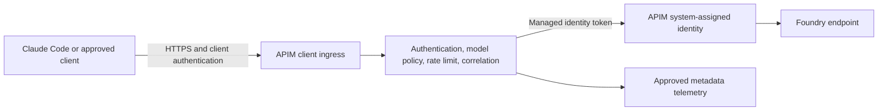

# APIM-governed profile

## Status

**Deployable version 1 profile.** The manifest CLI creates a dedicated APIM service through Bicep, grants its system-assigned identity Foundry inference access, deploys exact model versions through the existing engine, configures the APIM backend/API/POST wildcard operation and non-secret named values, installs the governed policy, and generates Claude Code configuration that uses the APIM base URL.

The profile is a community-sample capability, not a Microsoft or Anthropic support commitment. It has fake-Azure contract tests and Bicep compilation coverage; operators remain responsible for live service validation in their tenant.

Version 1 intentionally uses public APIM ingress and a public Foundry backend. Both remain protected by Microsoft Entra authentication and authorization. Private endpoints, VNet integration, adoption of an unrelated APIM service, custom domains, and client certificates are not implemented.

## Intended topology

## Intended responsibilities

APIM would provide a central enforcement point for:

- Client authentication and authorization.
- Approved model and deployment routing.
- Per-principal or per-application rate limits and quotas.
- Request correlation.
- Consistent error handling.
- Metadata-only diagnostics under the default telemetry policy.

Foundry remains the model inference service and final backend authorization boundary. APIM uses its system-assigned identity with `Cognitive Services User` scoped to the Foundry account.

## Identity design

The client identity and backend identity remain separate:

1. Claude Code obtains a Microsoft Entra token for the configured audience and sends it to APIM.
2. APIM validates tenant, issuer, Cognitive Services audience, expiration, signature, and required claims.
3. APIM requires the validated `oid` or `sub` to appear in the manifest principal allowlist, then applies model routing and rate policy.
4. APIM removes the caller credential and obtains its own managed identity token for Foundry.
5. APIM records approved metadata and a correlation identifier.

This design prevents the gateway from depending on every client receiving direct Foundry access. It also means Foundry observes the gateway identity, so user-level attribution must be handled at the gateway and telemetry layers without placing untrusted identity headers on a bypassable path.

## Deployment sequence

1. Validate the manifest and reject unsupported private networking, cost-alert, CIDR, or APIM-reuse declarations.
2. Run Bicep what-if and the model engine dry run for `plan`.
3. For `deploy`, repeat the engine preflight and require exact `ACCEPT` before mutation.
4. Deploy the resource group, Foundry resources when not reusing an account, identities, RBAC, Key Vault, monitoring, diagnostics, and APIM.
5. Run the existing engine for exact model deployment and workstation artifact generation.
6. Configure the APIM backend, non-secret named values, HTTP API, POST `/*` operation, and API policy through ARM.
7. Record the APIM endpoint and policy resources in the sanitized orchestration report.

The generated Claude Code configuration sets `CLAUDE_CODE_USE_FOUNDRY=1` and `ANTHROPIC_FOUNDRY_BASE_URL` to the APIM API path. It does not store an API key or bearer token.

## Policy controls

- Microsoft Entra JWT validation with manifest tenant and caller audience.
- Explicit allowlist of up to 100 Microsoft Entra user or service-principal object IDs.
- Required `tid` claim and stable `oid` with `sub` fallback.
- Per-principal rate limiting.
- Exact manifest-derived model and deployment allowlist.
- Correlation identifiers and metadata-only trace messages.
- Removal of caller credentials and subscription keys before forwarding.
- APIM system-assigned managed identity authentication to Foundry.
- Bounded backend timeout and response credential stripping.
- Unbuffered backend responses for Claude streaming.

## Remaining limitations

- Public networking is required for APIM and Foundry in version 1.
- The CLI creates a dedicated APIM service, permits idempotent reruns when ownership tags match, and rejects unrelated existing services.
- The installed API exposes a POST wildcard operation for the Anthropic path; other methods are not configured.
- The API identifier is fixed as `claude-foundry`; manifests cannot rename it and leave an older public API behind.
- Direct Foundry access is not automatically removed from existing users. Customer administrators must avoid assigning direct runtime access when bypass would violate policy.
- The repository does not run live authorized/denied inference tests, configure custom domains, or create an operations dashboard.
- Package declarations do not install MCP servers, skills, or plugins.
