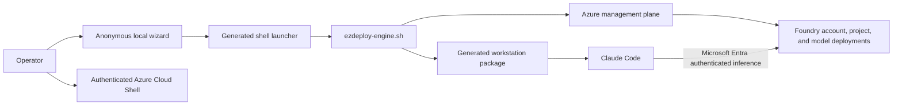

# Current direct profile

## Status

**Deployable repository capability.** The anonymous wizard continues to drive the original Cloud Shell engine. The manifest CLI adds subscription-scope Bicep infrastructure and then invokes the same engine for exact live model validation and deployment.

## Deployment flow

The wizard makes no network calls and does not sign in to Azure. The operator uploads the generated launcher and engine to Azure Cloud Shell. The engine performs live validation before mutation and requires explicit confirmation unless `--yes` is supplied.

## Resources and configuration

The engine currently creates or reuses:

- A resource group.
- An `AIServices` Foundry account with a custom endpoint and system-assigned identity.
- A named Foundry project with a system-assigned identity.
- Exact, version-pinned Claude model deployments using `NoAutoUpgrade`.
- An optional `Cognitive Services User` assignment for the signed-in user when no recognized effective runtime role exists.

New accounts disable local authentication. Reused accounts preserve their existing local-authentication setting unless the operator explicitly chooses `--disable-local-auth-on-reuse`.

## Identity paths

The deployment identity is the Azure CLI identity active in Cloud Shell. It needs management-plane permissions for resource operations and role-assignment permissions only when the optional assignment is requested.

The runtime identity is the Claude Code user's Microsoft Entra identity. Management-plane roles do not automatically grant inference access. Runtime authorization is evaluated through Foundry data-plane roles.

The system-assigned identities on the Foundry account and project are created for Azure resource identity, but the current client inference path does not impersonate those identities.

## Network path

The current engine does not create private endpoints, private DNS zones, virtual networks, firewall rules, or an organization-specific data perimeter. The Foundry service endpoint can therefore remain publicly reachable, with access controlled by Microsoft Entra authentication and Azure RBAC.

Operators that require private connectivity must not treat the current profile as satisfying that requirement. Applying network restrictions separately can also break the generated workstation path unless DNS and client connectivity are designed and validated.

## Data handling

Prompts, responses, tool inputs, and tool outputs travel directly between Claude Code and the Foundry endpoint according to the client and service behavior. The repository does not insert a gateway, request recorder, or OpenTelemetry collector.

Generated launchers and workstation artifacts contain environment metadata, including tenant and subscription identifiers, resource names, endpoints, deployment names, and model versions. They are not designed to contain secrets, but they must still be stored as internal deployment material.

## Current governance limits

- Model approval is encoded in the generated local configuration, not centrally enforced.
- Quota is checked before deployment, but runtime rate limits are not centrally applied.
- No gateway correlation identifier is generated.
- No shared MCP, skills, or plugin distribution service is deployed.
- No automated drift, rollback, cleanup, or live endpoint-validation command exists.

The manifest CLI uses `infra/` for the resource group, Foundry account and project when not reusing an existing account, managed identities, Key Vault, monitoring, diagnostics, and RBAC. It uses the shell engine for live catalog, quota, Marketplace, collision, exact-version model deployment, approval evidence, and workstation artifacts.

Use [Administration](../administration.md) and [Lifecycle](../lifecycle.md) for the current operator procedures and the boundaries that remain manual.
