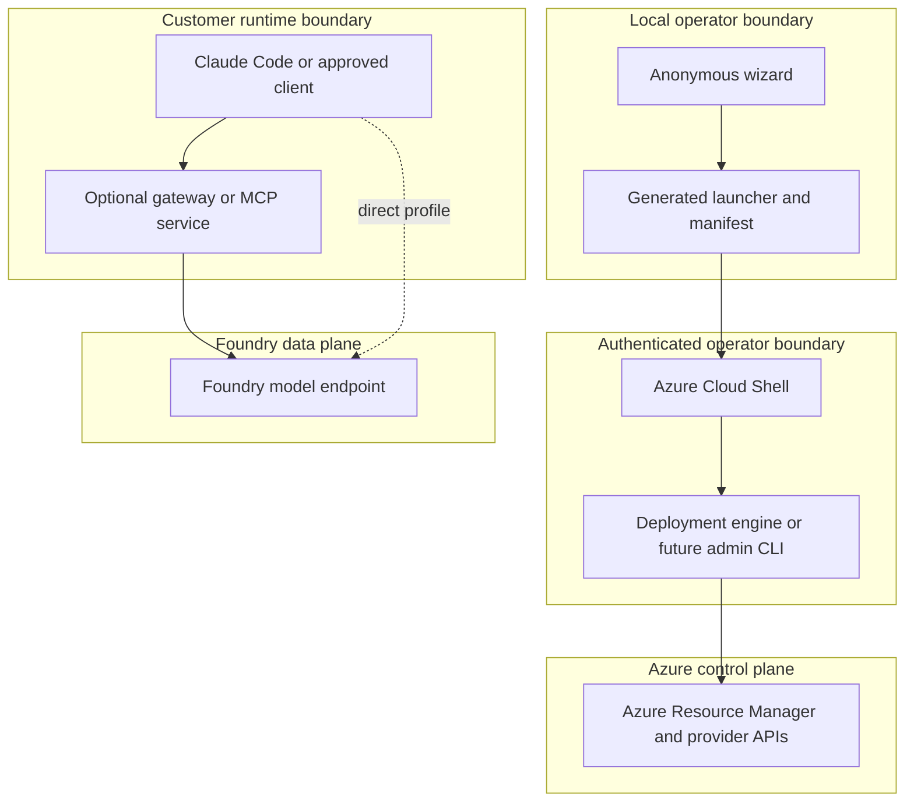

# Trust, identity, data, and network boundaries

## Trust boundaries

The local wizard is not a trusted Azure control plane. Its output is operator-reviewed input. Azure Cloud Shell and the active Azure CLI identity form the current deployment trust boundary.

An optional APIM or MCP service creates a new runtime trust boundary and must have independent authentication, authorization, logging, network, and lifecycle controls.

## Data classification

| Data | Default classification | Handling |
|---|---|---|
| Repository source, public docs, sanitized examples | Public | May be committed after review. |
| Tenant ID, subscription ID, resource IDs, endpoints, deployment names | Internal | May appear in local deployment artifacts; do not commit or publish. |
| Legal organization, country, industry, cost center, owner contacts | Internal or confidential | Limit to operators and approved deployment records. |
| Prompts, responses, tool inputs, tool outputs | Customer workload data; classification set by the customer | Do not log by default. Apply customer retention and regional requirements. |
| Access tokens, client secrets, keys, certificates, signed URLs | Secret | Never place in manifests, logs, reports, or source. Store only through an approved secret system. |
| Aggregated request metadata, latency, status, token counts | Internal; may become confidential when attributable | Collect only approved fields with defined retention and access. |

The manifest `governance.dataClassification` field records an operator declaration. It does not automatically configure Azure data controls.

## Control-plane roles

Control-plane operations create, update, inspect, or delete Azure resources. The deployment identity needs only the actions required by the chosen profile. Role-assignment privileges are separate and should be granted only when the deployment is authorized to create assignments.

Owner, Contributor, and other management-plane roles do not establish Foundry inference access.

## Data-plane roles

Data-plane roles authorize model inference. The current engine recognizes several Foundry and Cognitive Services runtime roles and can optionally assign `Cognitive Services User` to the signed-in user.

For gateway profiles, the gateway's managed identity receives backend inference access. Client access is evaluated at the gateway. Direct access for governed users should be absent or intentionally documented, otherwise gateway policy can be bypassed.

## Identity flows

### Current deployment

1. The operator signs in to Azure CLI.
2. The engine selects and verifies the target subscription and tenant.
3. Azure Resource Manager authorizes resource operations.
4. The optional role-assignment step resolves the signed-in user and checks direct and inherited runtime roles.

### Current inference

1. The user signs in through Azure CLI on the workstation.
2. Claude Code uses the configured Foundry resource and Microsoft Entra authentication.
3. Foundry evaluates the user's data-plane authorization.

### APIM-governed inference

1. The gateway validates the client identity.
2. Gateway policy authorizes the requested model and operation.
3. The gateway obtains a managed identity token for Foundry.
4. Foundry authorizes the gateway identity.
5. The gateway emits approved attribution metadata and a correlation identifier.

## Public and private network choices

| Choice | Client ingress | Foundry backend | Current support |
|---|---|---|---|
| Direct public | Public Foundry service endpoint | Public | Current |
| Direct private | Customer private connectivity | Private endpoint | Future |
| APIM public ingress | Public APIM endpoint with identity policy | Public Foundry endpoint with managed-identity authorization | Current manifest profile |
| APIM private ingress | Private APIM endpoint | Private endpoint | Future |
| Customer gateway | Customer-defined | Public or private, by contract | Future |

Private networking requires more than creating a private endpoint. The profile must cover DNS, routes, egress, client location, administrative access, certificate validation, monitoring, and break-glass recovery.

## Security review triggers

Repeat security and privacy review when a change:

- Adds a trust boundary or identity exchange.
- Enables public network access.
- Changes local authentication.
- Adds prompt, response, or tool-content telemetry.
- Adds a shared service or cross-tenant data path.
- Changes role scope or allows gateway bypass.
- Adds a package source, executable plugin, or secret reference.
